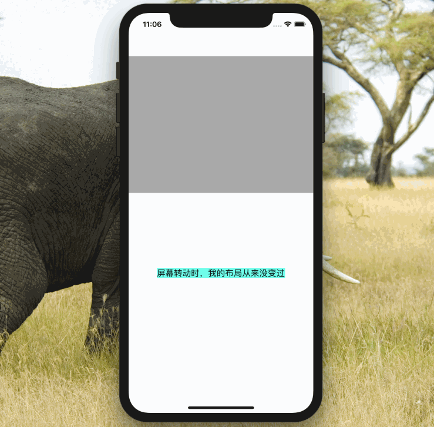

# SYFullScreenView

View 自动横屏全屏实现。

- 支持纯代码创建 View。
- 支持`Xib`、`Storyboar` 使用**类关联**创建 View。

# 参考
[https://techblog.toutiao.com/2017/03/28/fullscreen/](https://techblog.toutiao.com/2017/03/28/fullscreen/)